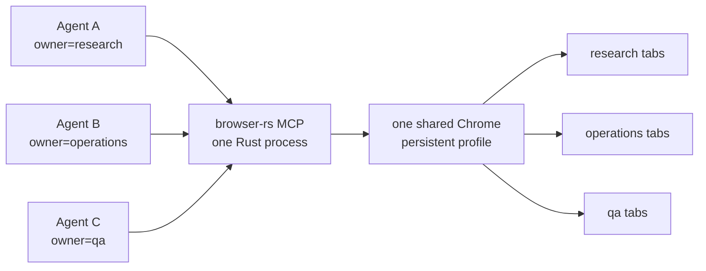

# browser-rs

**One real browser. Many agents. A ~5.5 MB Rust server.**

browser-rs is a lightweight, stealth-oriented browser MCP server. It gives
multiple agents isolated control of tabs in one shared Chrome process, with 62
Playwright-style browser tools and no Node.js runtime.



## Why browser-rs?

| | browser-rs | Node + Playwright-style stack |
|---|---:|---:|
| Server runtime | Single Rust binary | Node.js + npm dependency tree |
| Release artifact | ~5.5 MB | Runtime and packages installed separately |
| Server memory¹ | ~6 MB RSS | ~180 MB RSS |
| Multi-agent control | One Chrome, owner-isolated tab groups | Separate coordination required |
| Browser control | Raw CDP over one multiplexed WebSocket | Playwright |

¹ Historical maintainer measurements excluding Chrome, taken from idle local
servers. Exact memory varies by OS, build, runtime, and workload; treat these
figures as an order-of-magnitude comparison, not a benchmark guarantee. The
release binary size can be checked with `du -h target/release/browser-rs`.

The default mode uses a locally installed, headful Chrome with a persistent
profile. It avoids enabling the commonly fingerprinted CDP `Runtime` and
`Console` domains, evaluates in an isolated world, and does not inject page
patches. Headless `--stealth` is available as a best-effort fallback.

No browser automation stack can promise universal bot-detection bypass.
browser-rs minimizes common automation signals and ships reproducible detector
runners under [`bench/`](./bench) so changes can be tested against current
browsers and detectors.

## Install

On macOS arm64 and Linux x64, the installer downloads a prebuilt binary. A
locally installed Google Chrome or Chromium is also required.

```bash
curl -fsSL https://raw.githubusercontent.com/maestrojeong/browser-rs-mcp/main/install.sh | sh
browser-rs --help
```

The installer uses `/usr/local/bin`, or `~/.local/bin` when the former is not
writable. Set `AB_BIN_DIR` to choose another directory and `AB_VERSION` to pin
a release:

```bash
curl -fsSL https://raw.githubusercontent.com/maestrojeong/browser-rs-mcp/main/install.sh \
  | AB_VERSION=v0.1.12 AB_BIN_DIR="$HOME/bin" sh
```

Other options are listed in **[INSTALL.md](INSTALL.md)**, including direct
downloads, SHA-256 files, source installation, and updating a running binary.
Build from source with:

```bash
cargo install --git https://github.com/maestrojeong/browser-rs-mcp ab-mcp
```

Set `AB_CHROME` when Chrome is not in a standard location if needed.

## Start and connect

Use stdio for a client that launches the server:

```bash
browser-rs
```

Use HTTP when several agents should share one browser process and profile:

```bash
browser-rs --port 9321
# streamable HTTP: http://127.0.0.1:9321/mcp
# legacy SSE:      http://127.0.0.1:9321/sse
```

Example stdio configuration:

```jsonc
{
  "mcpServers": {
    "browser-rs": {
      "command": "browser-rs"
    }
  }
}
```

For HTTP, configure the client with `http://127.0.0.1:9321/mcp` for streamable
HTTP, or `/sse` for clients that still use legacy SSE. See
**[INSTALL.md](INSTALL.md)** for client-specific examples.

Keep HTTP on loopback unless it is behind a trusted, authenticated proxy. A
non-loopback bind requires `AB_HTTP_CAPABILITY`; clients must then send the
same value in `X-Browser-Capability`. This header is a capability check, not
TLS or a replacement for authentication.

## Multi-agent tabs

Each HTTP request can identify its topic, worker, or job with a stable owner:

```text
http://127.0.0.1:9321/mcp?owner=42%3A100%3Aresearch
X-Browser-Owner: 42:100:research
```

New tabs are assigned to the request owner. Each agent lists, switches, and
controls only its own tabs, even though every agent shares the same Chrome
process, login state, and persistent profile. Knowing another owner's page ID
is not sufficient to access it. An owner-scoped `browser_close` closes only
that agent's tabs without stopping the browser.

When a topic or job is deleted, close its tabs and mappings explicitly:

```bash
curl -X DELETE \
  'http://127.0.0.1:9321/owners?owner=42%3A100%3Aresearch'
```

This does not delete the browser profile or affect other owners. Connections
without an owner are administrative and can access all tabs, so do not expose
an ownerless HTTP endpoint publicly.

## Tools

MCP exposes 62 `browser_*` tools:

**Navigation and inspection:** `browser_navigate` · `browser_new_page` · `browser_snapshot` · `browser_read` · `browser_get_visible_html` · `browser_get_visible_text` · `browser_find` · `browser_take_screenshot` · `browser_save_pdf` · `browser_pages` · `browser_tabs` · `browser_switch_page` · `browser_profile` · `browser_status`

**Interaction:** `browser_click` · `browser_type` · `browser_press_key` · `browser_hover` · `browser_select_option` · `browser_fill_form` · `browser_drag` · `browser_file_upload` · `browser_navigate_back` · `browser_wait_for` · `browser_resize` · `browser_evaluate` · `browser_run_code_unsafe` · `browser_iframe_click` · `browser_iframe_fill` · `browser_close_page` · `browser_close`

**Network and requests:** `browser_network_requests` · `browser_route_block` · `browser_route_mock` · `browser_route_clear` · `browser_network_state_set` · `browser_api_request`

**Cookies and storage:** `browser_cookie_list` · `browser_cookie_get` · `browser_cookie_set` · `browser_cookie_delete` · `browser_cookie_clear` · `browser_localstorage_list` · `browser_localstorage_get` · `browser_localstorage_set` · `browser_localstorage_delete` · `browser_localstorage_clear` · `browser_sessionstorage_list` · `browser_sessionstorage_get` · `browser_sessionstorage_set` · `browser_sessionstorage_delete` · `browser_sessionstorage_clear` · `browser_storage_save` · `browser_storage_load`

**Diagnostics and page utilities:** `browser_console_messages` · `browser_fingerprint_check` · `browser_handle_dialog` · `browser_highlight` · `browser_hide_highlight` · `browser_webauthn` · `browser_claim_page` · `browser_release_page`

Most interaction tools accept a snapshot `ref` or a CSS selector. The common
workflow is: snapshot, act, then inspect the returned accessibility diff.

## CLI and environment

```text
browser-rs                          # stdio MCP transport
browser-rs --port 9321 [options]    # HTTP MCP transport
  --host <host>            HTTP bind host (default 127.0.0.1)
  --user-data-dir <path>   Persistent browser profile directory
  --profile <path>         Alias for --user-data-dir
  --headless               Run headless
  --headed                 Run headful (default)
  --connect <port|url>     Attach to an existing Chrome
  --stealth                Enable the JS fallback layer
```

`--port` enables HTTP mode; without it, the server uses stdio. The equivalent
environment variables are `AB_HTTP`, `AB_PROFILE`, `AB_HEADLESS`, `AB_CONNECT`,
`AB_STEALTH`, and `AB_CHROME`. `AB_HTTP_CAPABILITY` protects HTTP/SSE requests
with `X-Browser-Capability` and is required for non-loopback binds.

For `--connect`, start Chrome with an explicit remote debugging port, then pass
that port or its URL:

```bash
google-chrome --remote-debugging-port=9222
browser-rs --connect 9222
```

## Development

Requirements: Rust 1.85 or newer, Chrome/Chromium, and Node.js for the optional
benchmark scripts.

```bash
cargo test --workspace
cargo build --release -p ab-mcp
```

The `bench/` directory contains local detector and browser comparison runners.
They are regression tools whose results depend on browser versions, sites, and
detectors; they are not compatibility or stealth guarantees:

```bash
node bench/run.mjs target/release/browser-rs
node bench/external.mjs target/release/browser-rs
node bench/rebrowser.mjs target/release/browser-rs
```

See [DESIGN.md](DESIGN.md) for architecture and tradeoffs. The source is
organized into `ab-cdp` (CDP transport), `ab-browser` (browser and page logic),
and `ab-mcp` (the MCP server).

## Release

Update `workspace.package.version` in `Cargo.toml`, then commit and tag:

```bash
git commit -am "Release vX.Y.Z"
git tag vX.Y.Z
git push origin main vX.Y.Z
```

The `v*` tag workflow builds macOS arm64 and Linux x64 binaries, publishes
SHA-256 files, and attaches them to the GitHub Release. `install.sh` fetches the
latest release by default; set `AB_VERSION=vX.Y.Z` to pin one.

## License

Apache-2.0. See [LICENSE](LICENSE).
