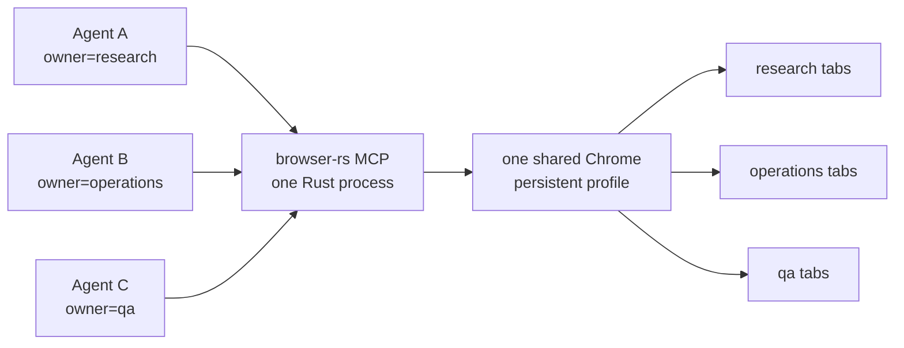

# browser-rs

**One real browser. Many agents. A ~5.5 MB Rust server.**

[](https://github.com/maestrojeong/browser-rs-mcp/actions/workflows/ci.yml)
[](https://github.com/maestrojeong/browser-rs-mcp/releases)
[](LICENSE)


browser-rs is a lightweight, stealth-oriented browser MCP server. It lets
multiple AI agents share one logged-in Chrome — each agent controls only its
own tabs — for parallel scraping, web automation, and QA without every agent
spinning up its own browser. 64 Playwright-style tools, one Rust binary, no
Node.js runtime.



## Why browser-rs?

| | browser-rs | Playwright/Puppeteer-based MCP (Node) |
|---|:--|:--|
| Server runtime | Single Rust binary | Node.js + npm dependency tree |
| Release artifact | ~5.5 MB | Runtime and packages installed separately |
| Server memory¹ | ~6 MB RSS | ~180 MB RSS |
| Multi-agent control | One Chrome, owner-isolated tab groups | Separate coordination required |
| Browser control | Raw CDP over one multiplexed WebSocket | Playwright |

The default mode uses a locally installed, headful Chrome with a persistent
profile and does not inject page patches, minimizing common automation signals.
It does **not** guarantee bot-detection bypass — no automation stack can — but
ships reproducible detector runners under [`bench/`](./bench) so changes can be
tested against current browsers and detectors. See [DESIGN.md](DESIGN.md) for
how the stealth defaults work.

¹ Historical maintainer measurements excluding Chrome, taken from idle local
servers. Exact memory varies by OS, build, runtime, and workload; treat these
figures as an order-of-magnitude comparison, not a benchmark guarantee. The
release binary size can be checked with `du -h target/release/browser-rs`.

## Quick start

**1. Install** — on macOS arm64 and Linux x64 the installer downloads a
prebuilt binary. A locally installed Google Chrome or Chromium is also required.

```bash
curl -fsSL https://raw.githubusercontent.com/maestrojeong/browser-rs-mcp/main/install.sh | sh
browser-rs --help
```

**2. Run** — use stdio for a client that launches the server:

```bash
browser-rs
```

**3. Verify** — point an MCP client at it and drive the browser:

```text
browser_navigate  → https://example.com   # a headful Chrome window opens
browser_snapshot                          # returns the accessibility tree
```

The common workflow is: `browser_snapshot`, act, then inspect the returned
accessibility diff. Most interaction tools accept a snapshot `ref` or a CSS
selector.

Other install options — direct downloads, SHA-256 files, source builds, and
updating a running binary — are in **[INSTALL.md](INSTALL.md)**. To build from
source:

```bash
cargo install --git https://github.com/maestrojeong/browser-rs-mcp ab-mcp
```

Set `AB_CHROME` if Chrome is not in a standard location.

## Connect an MCP client

Example stdio configuration:

```jsonc
{
  "mcpServers": {
    "browser-rs": {
      "command": "browser-rs"
    }
  }
}
```

Use HTTP when several agents should share one browser process and profile:

```bash
browser-rs --port 9321
# streamable HTTP: http://127.0.0.1:9321/mcp
# legacy SSE:      http://127.0.0.1:9321/sse
```

Configure the client with `http://127.0.0.1:9321/mcp` for streamable HTTP, or
`/sse` for clients that still use legacy SSE. Keep HTTP on loopback unless it is
behind a trusted, authenticated proxy; non-loopback binds and the
`X-Browser-Capability` header are covered in **[INSTALL.md](INSTALL.md)**.

## Multi-agent tabs

Each HTTP request identifies its topic, worker, or job with a stable owner (via
an `?owner=` query param or the `X-Browser-Owner` header). New tabs are assigned
to the request owner, and each agent lists, switches, and controls only its own
tabs — even though every agent shares the same Chrome process, login state, and
persistent profile. An owner-scoped `browser_close` closes only that agent's
tabs without stopping the browser.

Owner isolation is an in-process scope, not an authentication boundary.
Connections without an owner are administrative and can access all tabs, so do
not expose an ownerless HTTP endpoint publicly. Owner setup, per-owner cleanup,
and capability-header details are in **[INSTALL.md](INSTALL.md)**.

## Tools

MCP exposes 64 `browser_*` tools:

**Navigation and inspection:** `browser_navigate` · `browser_new_page` · `browser_snapshot` · `browser_activate_page` · `browser_read` · `browser_get_visible_html` · `browser_get_visible_text` · `browser_find` · `browser_take_screenshot` · `browser_save_pdf` · `browser_pages` · `browser_tabs` · `browser_switch_page` · `browser_profile` · `browser_status`

**Interaction:** `browser_click` · `browser_wheel` · `browser_type` · `browser_press_key` · `browser_hover` · `browser_select_option` · `browser_fill_form` · `browser_drag` · `browser_file_upload` · `browser_navigate_back` · `browser_wait_for` · `browser_resize` · `browser_evaluate` · `browser_run_code_unsafe` · `browser_iframe_click` · `browser_iframe_fill` · `browser_close_page` · `browser_close`

Use `browser_activate_page({ "page": "p5" })` before automating a background
tab whose site throttles lazy loading. It calls CDP `Target.activateTarget`,
retries visibility/focus verification, and uses a process-specific macOS
foreground fallback when browser-rs launched Chrome itself. Use
`browser_wheel({ "page": "p5", "delta_y": 700, "x": 650, "y": 500 })` for a
real CDP `mouseWheel` event instead of DOM `window.scrollBy()`.

**Network and requests:** `browser_network_requests` · `browser_route_block` · `browser_route_mock` · `browser_route_clear` · `browser_network_state_set` · `browser_api_request`

**Cookies and storage:** `browser_cookie_list` · `browser_cookie_get` · `browser_cookie_set` · `browser_cookie_delete` · `browser_cookie_clear` · `browser_localstorage_list` · `browser_localstorage_get` · `browser_localstorage_set` · `browser_localstorage_delete` · `browser_localstorage_clear` · `browser_sessionstorage_list` · `browser_sessionstorage_get` · `browser_sessionstorage_set` · `browser_sessionstorage_delete` · `browser_sessionstorage_clear` · `browser_storage_save` · `browser_storage_load`

**Diagnostics and page utilities:** `browser_console_messages` · `browser_fingerprint_check` · `browser_handle_dialog` · `browser_highlight` · `browser_hide_highlight` · `browser_webauthn` · `browser_claim_page` · `browser_release_page`

## CLI and environment

```text
browser-rs                          # stdio MCP transport
browser-rs --port 9321 [options]    # HTTP MCP transport
  --host <host>            HTTP bind host (default 127.0.0.1)
  --user-data-dir <path>   Persistent browser profile directory
  --profile <path>         Alias for --user-data-dir
  --headless               Run headless
  --headed                 Run headful (default)
  --connect <port|url>     Attach to an existing Chrome
  --stealth                Enable the JS fallback layer
```

`--port` enables HTTP mode; without it, the server uses stdio. The equivalent
environment variables are `AB_HTTP`, `AB_PROFILE`, `AB_HEADLESS`, `AB_CONNECT`,
`AB_STEALTH`, and `AB_CHROME`. `AB_HTTP_CAPABILITY` protects HTTP/SSE requests
with `X-Browser-Capability` and is required for non-loopback binds.

Managed hosts can set `AB_MANAGED=1`, `AB_HTTP_CAPABILITY=<random-root>`, and
`AB_SPAWN_NONCE=<random-nonce>`. In this mode `/health` reports the spawn nonce,
`/owners` requires the root capability, and each `/sse` or `/mcp` connection
requires `X-Browser-Capability = HMAC-SHA256(root, owner)`. Streamable HTTP
sessions are pinned to their authenticated owner, while legacy SSE message
posts use a random per-session token. The root capability and spawn nonce are
removed from the environment before Chrome is launched.

`AB_ALLOWED_TOOLS` optionally limits the published and callable tool names to a
comma-separated allowlist. It is intended for embedding hosts; an unset value
keeps the complete standalone catalog.

Managed hosts may also set both `AB_SECRET_BROKER_SOCKET` and
`AB_SECRET_BROKER_TOKEN`. Browser.rs sends each tool input through the broker
before dispatch and sends the result through it again before returning data to
the client. The broker owns secret lookup and retained redaction forms; the
Rust process never reads the host's credential database. Broker timeouts,
malformed replies, and redaction failures fail closed. Broker credentials are
removed from the environment before Chrome is launched.

For `--connect`, start Chrome with an explicit remote debugging port, then pass
that port or its URL:

```bash
google-chrome --remote-debugging-port=9222
browser-rs --connect 9222
```

## Development

Requirements: Rust 1.85 or newer, Chrome/Chromium, and Node.js for the optional
benchmark scripts.

```bash
cargo test --workspace
cargo build --release -p ab-mcp
```

The `bench/` directory contains local detector and browser comparison runners.
They are regression tools whose results depend on browser versions, sites, and
detectors; they are not compatibility or stealth guarantees:

```bash
node bench/run.mjs target/release/browser-rs
node bench/external.mjs target/release/browser-rs
node bench/rebrowser.mjs target/release/browser-rs
```

See [DESIGN.md](DESIGN.md) for architecture and tradeoffs. The source is
organized into `ab-cdp` (CDP transport), `ab-browser` (browser and page logic),
and `ab-mcp` (the MCP server).

<details>
<summary><strong>Release (maintainers)</strong></summary>

Update `workspace.package.version` in `Cargo.toml`, then commit and tag:

```bash
git commit -am "Release vX.Y.Z"
git tag vX.Y.Z
git push origin main vX.Y.Z
```

The `v*` tag workflow builds macOS arm64 and Linux x64 binaries, publishes
SHA-256 files, and attaches them to the GitHub Release. `install.sh` fetches the
latest release by default; set `AB_VERSION=vX.Y.Z` to pin one.

</details>

## License

Apache-2.0. See [LICENSE](LICENSE).
